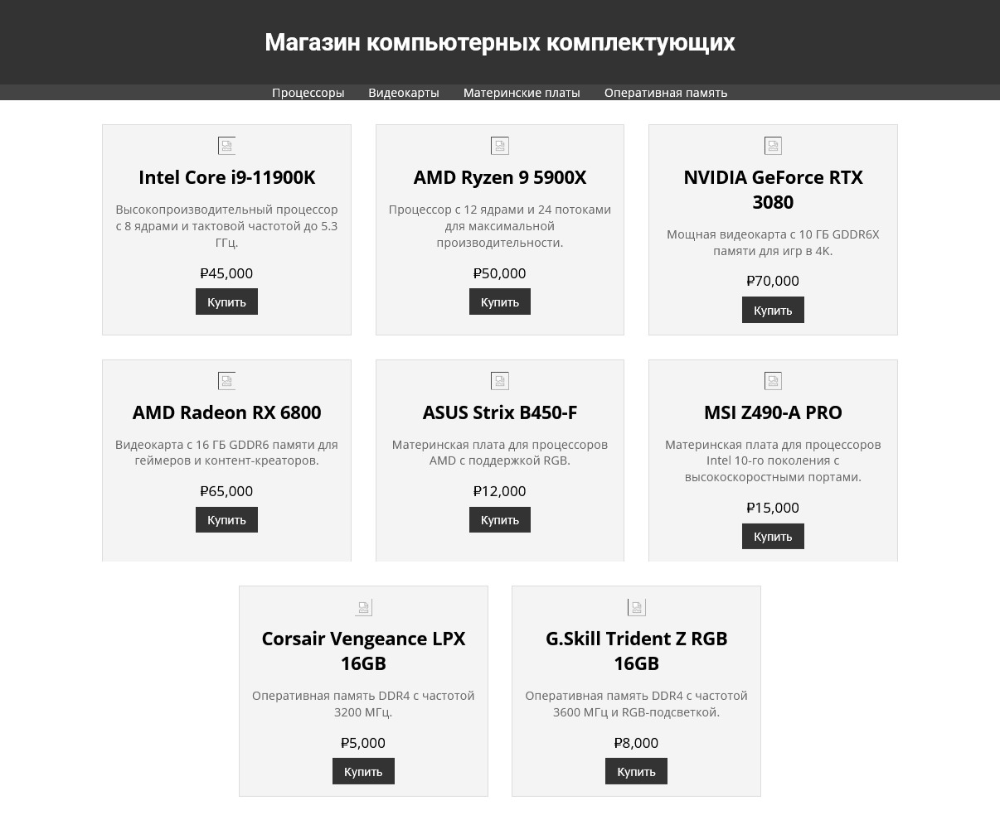
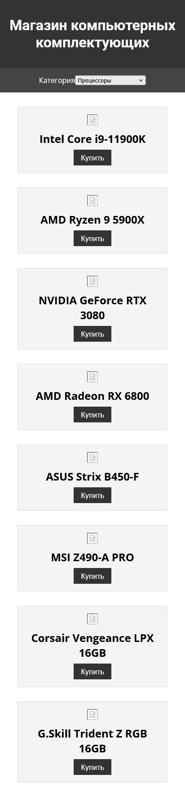

# Использование адаптивной верстки

## Срок сдачи работ

Последний коммит и пул реквест должен быть оформлен до ???

## Цель:

Создайте верстку страницы с двумя адаптивными схемами размещения элементов. Картинки необходимо добавить самому.

### Десктоп

<p align="center">
    
</p>

### Мобилка (768px брейкпоинт)

<p align="center">
    
</p>

### Резет CSS

Подключите [данный](https://gist.githubusercontent.com/ktkv419/c8840dfcbcff24248c20f4199108b28e/raw/a4aac6b59c95922023a26177bac72aaeffc4cbec/reset.css) CSS файл перед подключением вашего для нормализации правил CSS

### Шрифты

- Roboto
- OpenSans

## Как сдавать

1. Создайте форк репозитория в организации `21ISR` с названием `uidev-lab9-вашафамилия`
2. Используя ветку `wip` оформите необходимые файлы
3. Зафиксируйте изменения в вашем репозитории
4. Когда документ будет готов - создайте пул реквест из ветки `wip` (вашей) на ветку `main` (тоже вашу) и укажите меня ([ktkv419](https://github.com/ktkv419)) как reviewer

**Не мержите сами коммит**, это сделаю я после проверки задания

## Теория

### Адаптивная верстка

@media используется для применения разных стилей в зависимости от условий, таких как размер экрана

```css
body {
  font-size: 16px;
}

@media (max-width: 600px) {
  body {
    font-size: 14px;
  }
}
```

### Переменные CSS

Переменные CSS (или кастомные свойства) позволяют хранить значения и использовать их повторно в различных частях стилей. Они объявляются с использованием -- и могут быть использованы через var()

```css
:root {
  --main-color: #3498db;
  --font-size: 16px;
}

body {
  color: var(--main-color);
  font-size: var(--font-size);
}

@media (max-width: 600px) {
  :root {
    --font-size: 14px;
  }
}
```
